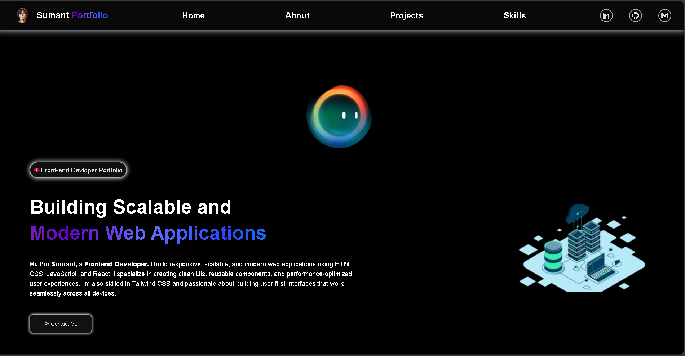
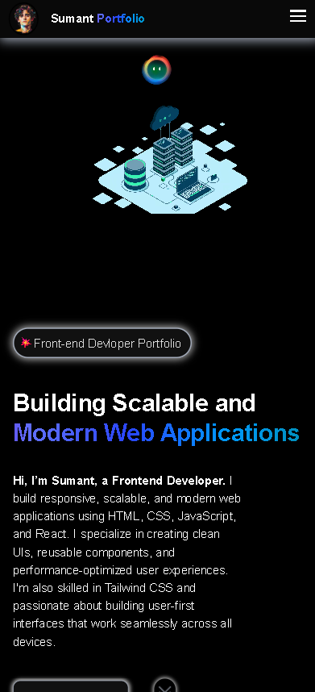
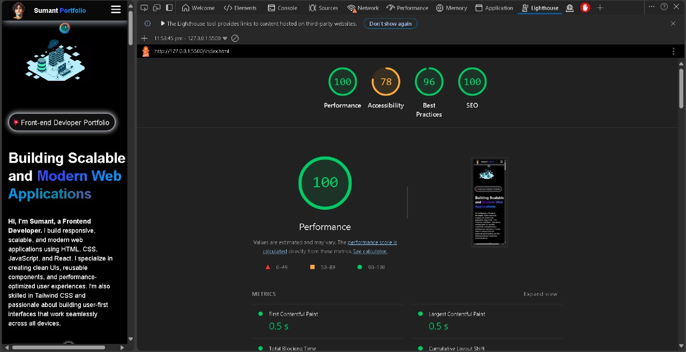

# 🌐 Personal Portfolio Website

A **unique and fully responsive** personal portfolio website built using **HTML, CSS, and JavaScript**.  
This project showcases my skills, projects, and contact information with a modern, clean, and interactive UI.

---

## 🚀 Features

- ⚡ **100% Performance Score** on Google Lighthouse
- 💻 **Fully Responsive** for all devices (Mobile, Tablet, Desktop)
- 🔄 Works in both **Landscape and Portrait** orientations
- 🎨 Modern, elegant design with smooth animations
- 🧭 Easy navigation with smooth scroll
- 📂 Clean and well-structured codebase

---

## 🛠️ Tech Stack

- **HTML5** – For structured, semantic markup
- **CSS3** – For styling and responsive layout (Flexbox & Grid)
- **JavaScript (ES6)** – For interactivity and animations

---

## 🧩 Sections

- **Hero** – Introduction and call-to-action
- **About** – Personal details and background
- **Skills** – Technologies and tools I use
- **Projects** – Showcase of my best work
- **Contact** – Simple way to get in touch
- **Footer** – Social links and copyright

---

## 📸 Screenshots

| Description              | Screenshot                                                                   |
| ------------------------ | ---------------------------------------------------------------------------- |
| 🏠 Homepage              |                |
| 📱 Responsive Layout     |             |
| ⚡ Lighthouse 100% Score |  |

## 🌍 Live Demo

🔗 **[View Portfolio Website](https://sumantkumarsinghportfolio.netlify.app/)**

---

## 🧠 Lighthouse Results

- ✅ Performance: 100%
- ✅ Accessibility: 78%
- ✅ Best Practices: 96%
- ✅ SEO: 100%

(See screenshots above for proof.)

---

## 🪄 Future Enhancements

- Add dark/light theme toggle

- Integrate contact form with backend (using Strapi / EmailJS)

- Include blog section

---

## 🧑‍💻 Author

- Sumant Kumar Singh
- 🌟 Frontend Developer
- 🔗 **[GitHub Profile](https://github.com/SumantKrSingh)**

---

## 📦 Installation

1. Clone the repository:

```bash
   git clone https://github.com/SumantKrSingh/personal-portfolio-website.git
```

2. Open `index.html` in your browser
